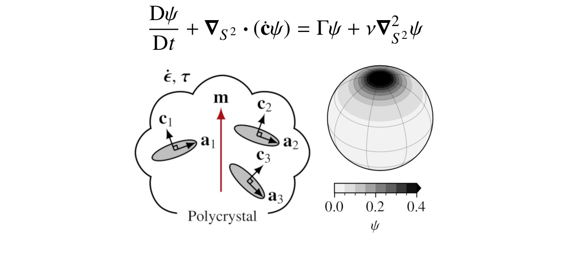

# Spectral orientation fabric 

**Lattice rotation:**

Rathmann, N., Hvidberg, C., Grinsted, A., Lilien, D., & Dahl-Jensen, D. (2021). Effect of an orientation-dependent non-linear grain fluidity on bulk directional enhancement factors. Journal of Glaciology, 67(263), 569-575. doi:10.1017/jog.2020.117

**Dynamic recrystallization:**

Rathmann and Lilien 2021 (in prep.)

## Contains
- Modules for: Fortran (`make specfab.o`) and Python (`make specfabpy`).
- Demos for: Fortran (`make demo`) and Python (`make demopy`).
- `plot.py` script for plotting solutions of the demos (netCDF dumps).

## Q&A
- **Q** What *L* are possible?
  - **A** Any 4<=*L*<=20. If higher *L* are required:
    1. `cd include && python3 make_gaunt_coefs.py L` (replacing *L*)
    2. `make clean && make specfab.o`
